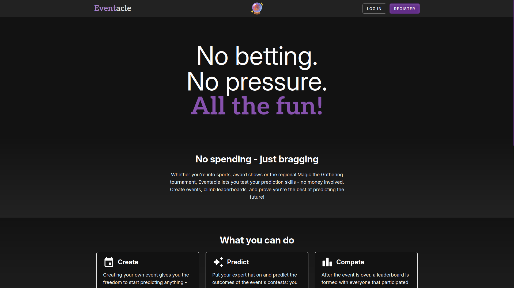
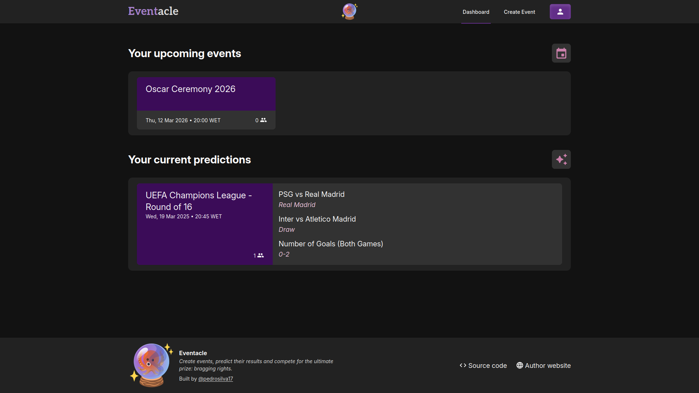
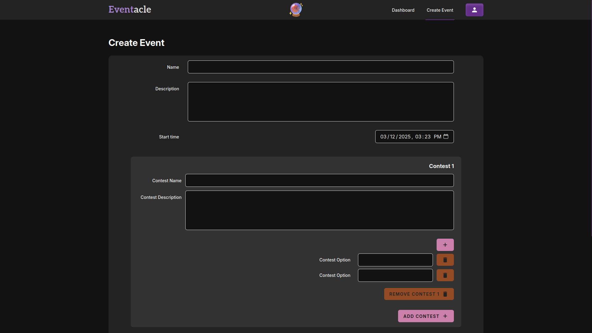
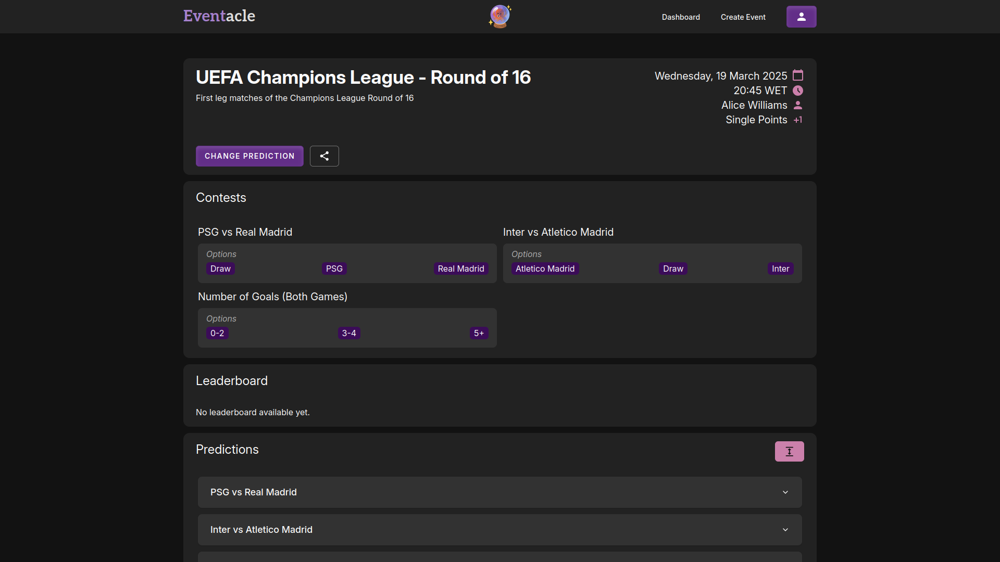
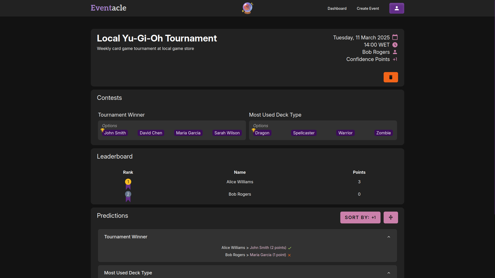
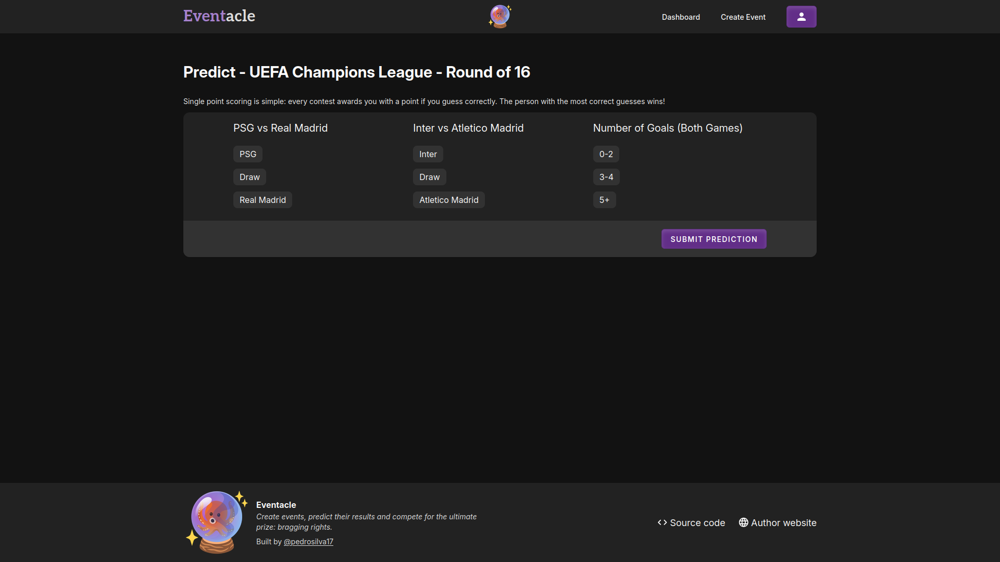

<div align="center">
    
</div>

<h1 align="center"> Eventacle </h1>
<p align="center">Create events, predict their results and compete with your friends for the ultimate prize: bragging rights.</p>

------

## About

**Eventacle** transforms prediction contests into a hassle-free, spending-free experience. If you enjoy guessing the outcomes of various events such as sports, cerimonies or competitions (especially with friends), this website is for you.

## Core Features

- **Create** - Set up your own events and define what others can predict
- **Predict** - Make predictions for upcoming events
- **Compete** - Join leaderboards and prove your prediction skills

## What Makes Eventacle Unique

- **No money involved** - Relax and have fun, with no money on the line
- **Diverse events** - Not limited to sports, not limited to known events
- **Fun for everyone** - Suitable for all ages and interests

## Self-hosting

### Prerequisites

- Git
- Node.js/npm
- PHP/Composer

### Installation

1. Clone the repository:
```bash
git clone https://github.com/pedrosilva17/eventacle.git
cd eventacle
```

2. Configure environment variables:
```bash
cp .env.example .env
# Edit APP_ADMIN_EMAIL and APP_ADMIN_PASSWORD for your initial admin account
```

3. Build and start the application:
```bash
./build.sh && ./start.sh
```

The application should now be running at `http://localhost:3000`. Enjoy!

## Screenshots








## The Name

**Eventacle** combines:
- **Event** - What is being predicted
- **Oracle** - _"someone who knows a lot about a subject and can give good advice"_ - prove to your friends you're that person!
- **Tentacle** - A nod to Paul the Octopus, the famous animal that correctly predicted multiple matches in the 2010 FIFA World Cup

Very creative, I know. But can you do better than Paul's 85% success rate?

---
_DISCAIMER: The emoji used in this README and as a logo on the app was created using [Emoji Kitchen](https://emoji.kitchen/). All rights for the emoji belong to their respective owners._